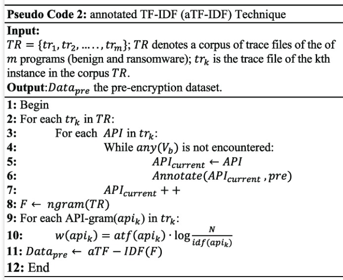

# TFIDF Algorithm
Implementation of the TF-IDF algorithm to identify the most important words in each news and assign corresponding categories or tags

Google has been using TF-IDF (or TF  IDF, TF*IDF, TFIDF, TF.IDF) to rank your content for a long time. It seems that Google focuses more on term frequency rather than on counting keywords. 

So, it’s important to wrap your head around the TF-IDF algorithm and how it works.

https://www.freecodecamp.org/portuguese/news/como-processar-dados-textuais-usando-o-tf-idf-em-python/
https://www.geeksforgeeks.org/understanding-tf-idf-term-frequency-inverse-document-frequency/

Passo 1: Coletar e preparar os dados  
O primeiro passo é coletar o conjunto de documentos que compõem o seu corpus, que podem ser páginas de um site, artigos, posts de blog, entre outros. Em seguida, deve-se preparar os textos, removendo qualquer informação irrelevante, como pontuação e caracteres especiais, além de aplicar técnicas de pré-processamento de linguagem natural, como a lematização e a remoção de stopwords (palavras comuns que não agregam valor semântico).  

Passo 2: Calcular o Term Frequency (TF)  
Para calcular o TF para cada termo em um documento, conte quantas vezes cada um aparece no texto e divida esse valor pelo total de palavras no documento.

Passo 3: Calcular o Inverse Document Frequency (IDF)  
Utilize a fórmula mencionada anteriormente para calcular o IDF para cada termo.  

Passo 4: Calcular o TF-IDF  
Agora que temos os valores do TF e IDF para cada termo e documento, podemos calcular o TF-IDF para cada termo em cada documento, multiplicando os valores do TF pelo IDF.

Passo 5: Interpretar os resultados do cálculo  
Após calcular o TF-IDF para todos os termos em todos os documentos, é hora de interpretar os resultados. Identifique os termos com maiores valores de TF-IDF em cada documento, pois eles são os mais relevantes para aquele conteúdo específico.